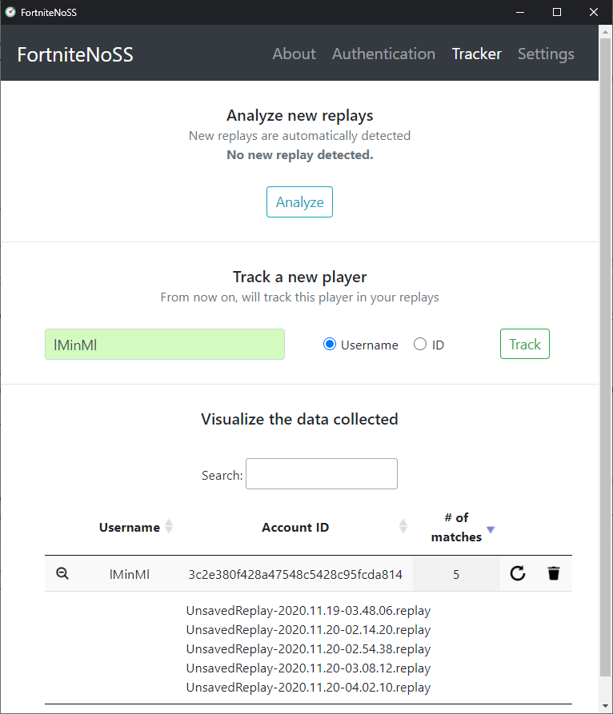

# Fortnite No Stream Snipers (FortniteNoSS)
Small python app that can track the players which appear in your Fortnite matches.
Using [FortniteReplayDecompressor](https://github.com/Shiqan/FortniteReplayDecompressor), the app extrack the data needed from your Fortnite replays and presents to you the results.

 
This app can be useful to streamers. It allows them to track suspicious players that often appear in their match.
 
 

